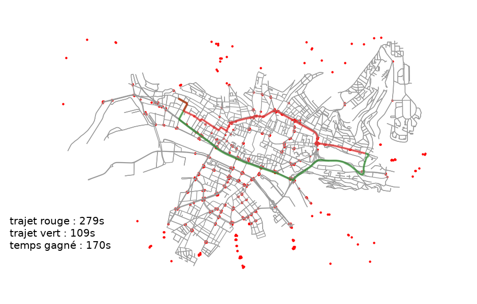

# Optimisation of travel time when travelling in an urban environment
This project was made in 2018-2019 for the entrance exams for the Grandes Écoles with [Hugo Paris](https://www.linkedin.com/in/hugo-paris-497571195/). We asked ourselves whether routing algorithms could be adapted to time-dependent graphs. We implemented the Djikstra algorithm in the case of a network with traffic lights. Then, we applied our model to real world data using OpenSreetMap. 

*Here is a map of the road network of Rouen, France. The red dots correspond to traffic lights. A classical routing algorithm (in red) would choose the fastest path, without taking into account traffic lights. Whereas our algorithm (in green) is able to be 3 minutes faster by avoiding traffic lights.*
